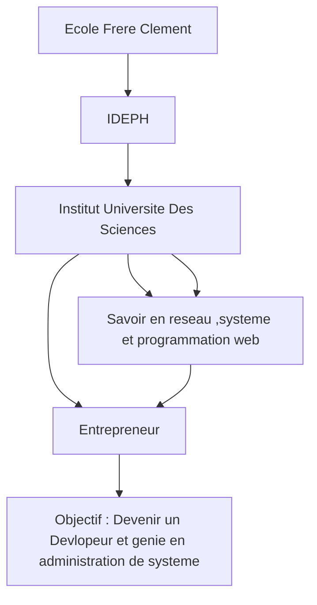

# **Bonjour/Bonsoir ,Ici mon  Organisation des Études et Projets**
*Cliford COFFY*
Le 1 Avril 2026
📍 Jacmel, Haïti

---

## **Table des Matières**
- [**Bonjour/Bonsoir ,Ici mon  Organisation des Études et Projets**](#bonjourbonsoir-ici-mon--organisation-des-études-et-projets)
  - [**Table des Matières**](#table-des-matières)
  - [**Introduction**](#introduction)
  - [**Objectifs du Projet**](#objectifs-du-projet)
  - [**Diagramme de Mon Parcours**](#diagramme-de-mon-parcours)

---

## **Introduction**
Vous pouvez voir que ce document présente mon organisation personnelle pour gérer mes **études**, mes **projets** et mes **objectifs professionnels**. Il inclut une **table des matières** pour une navigation facile et un **diagramme** pour visualiser mon parcours.

---

## **Objectifs du Projet**
- **Améliorer** ma productivité en utilisant des outils comme Markdown et Mermaid.
- **Organiser** mes tâches et projets de manière claire et visuelle.
- **Partager** mes méthodes avec d'autres étudiants ou professionnels en Haïti.

---

## **Diagramme de Mon Parcours**

